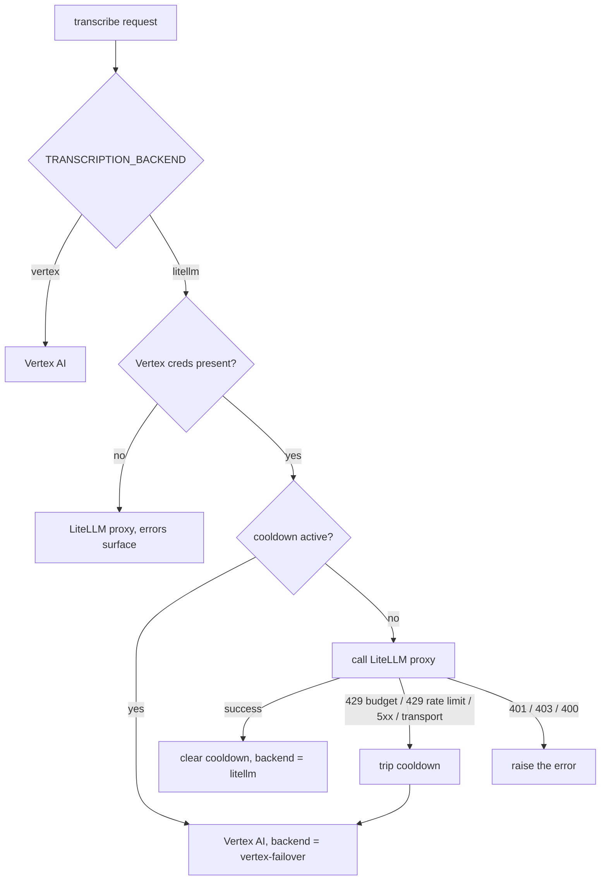

# Transcription Backends and Failover

Speaker-labelled transcription runs on one of two backends, selected by
`TRANSCRIPTION_BACKEND`:

| Backend | Route | Model env | Credentials |
|---------|-------|-----------|-------------|
| `vertex` (default) | Vertex AI `generateContentStream` | `options.model`, default `gemini-3-flash-preview` | GCP service account |
| `litellm` | OpenAI-compatible `/chat/completions` with an `input_audio` block | `LITELLM_TRANSCRIBE_MODEL` | Proxy API key |

Both backends share the same prompt and the same post-processing, including
speaker fingerprinting (see
[SPEAKER_FINGERPRINTING.md](SPEAKER_FINGERPRINTING.md)), so switching backends
does not change transcript structure or speaker handling.

Both must emit `[m:ss]` timestamps per turn, because fingerprinting samples audio
from those ranges. Verified on `gemini-3-flash-preview` via Vertex and on
`litellm/gemini-flash` via the dev-ai proxy.

## Why there is a failover

The LiteLLM proxy enforces a per-key spend cap. When the cap is reached every
request returns `429 Budget has been exceeded`, and a long recording fails
after the whole audio payload has already been uploaded. Vertex AI bills to a
different account (the GCP project) and has an independent quota, so it can
carry transcription while the proxy is unavailable.

Anthropic models are not an option here: they have no audio input modality.
The failover is between the two Gemini routes only.

## Failure classification

`src/lib/transcription/backend-failover.ts` classifies a proxy failure and
picks how long to stay away from it:

| Kind | Trigger | Cooldown |
|------|---------|----------|
| `budget` | `429` whose body mentions a budget | 30 min |
| `rate_limit` | any other `429` | 5 min |
| `server` | `5xx`, aborts, socket/DNS failures | 2 min |
| `fatal` | `400`, `401`, `403`, programming errors | none, the error is raised |

A `fatal` failure would fail identically on Vertex, so it is surfaced rather
than hidden behind a silent backend swap.

## When it swaps back

Automatically, on the first transcription after the cooldown expires. The
cooldown lives in memory in the app process, so a container restart also counts
as "try the proxy again now". A successful LiteLLM call clears the cooldown
immediately.

The cooldown exists purely to avoid re-uploading a large audio file to a
backend that is known to be capped; it is not a permanent switch, and nothing
needs to be flipped by hand to go back.

## What the user sees

- A warning toast on completion explaining which backend ran, why, and roughly
  when LiteLLM is retried.
- A badge beside the transcription heading showing the backend that produced
  the stored transcript. `vertex (failover)` is highlighted in amber.
- `transcriptions.transcription_backend` (`vertex` / `litellm` /
  `vertex-failover`) and `transcriptions.model` record what actually ran, not
  what was configured.

## Managing Vertex access

Failover only engages when `GOOGLE_PROJECT_ID` is set. If it is empty the proxy
error is raised unchanged, so a deployment without GCP credentials behaves
exactly as before.

- `GOOGLE_APPLICATION_CREDENTIALS` points at a service-account JSON mounted
  read-only at runtime (`/run/secrets/google-service-account.json` in
  docker-compose, from the host path in `GOOGLE_CREDENTIALS_FILE`). The file is
  never committed.
- The service account needs the Vertex AI User role on the project in
  `GOOGLE_PROJECT_ID`.
- Gemini 3 models are only served from the `global` location; the provider
  selects this automatically and uses `GOOGLE_LOCATION` for older models.
- Vertex usage bills to the GCP project, so a long LiteLLM outage moves spend
  from the proxy budget to GCP. Watch for repeated `vertex (failover)` badges
  as the signal that the proxy cap needs raising.
