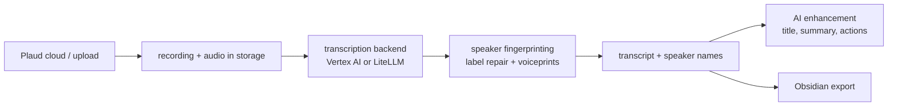

# Documentation Overview

Index of the documentation in this fork. Start here.

| Doc | What it covers |
|-----|----------------|
| [SPEAKER_FINGERPRINTING.md](SPEAKER_FINGERPRINTING.md) | How speakers are identified, how over-split labels are repaired, and how voiceprints persist across recordings |
| [TRANSCRIPTION_BACKENDS.md](TRANSCRIPTION_BACKENDS.md) | The Vertex AI and LiteLLM transcription backends, automatic failover, cooldowns, and Vertex credential management |
| [API.md](API.md) | HTTP API routes |
| [AUTO_SYNC.md](AUTO_SYNC.md) | Automatic sync from the Plaud cloud |
| [DEPLOYMENT.md](DEPLOYMENT.md) | Deploying the app |
| [DEVELOPMENT.md](DEVELOPMENT.md) | Local development setup |
| [FORK_STATE.md](FORK_STATE.md) | Fork-vs-upstream state, infrastructure context, and feature status |
| [changelog.md](changelog.md) | Dated log of every change |

## How transcription fits together

- Which model runs, and what happens when the proxy is capped:
  [TRANSCRIPTION_BACKENDS.md](TRANSCRIPTION_BACKENDS.md)
- Who said what, and remembering voices:
  [SPEAKER_FINGERPRINTING.md](SPEAKER_FINGERPRINTING.md)
